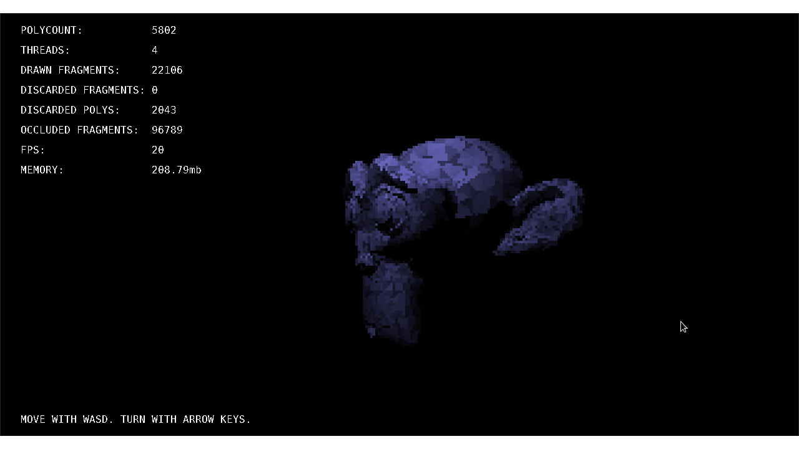

# Java Software Rasterizer

**CS Final project 2018.**

### Building:

GNU Make is recommended to build the project.

To build, run either:

	make

in the root directory of the project, or

	BuildAndRun.bat

in the project directory.

### Features:

* Loading OBJ Files
* Backface culling
* Textured meshes
* Matrix transforms
* User movement